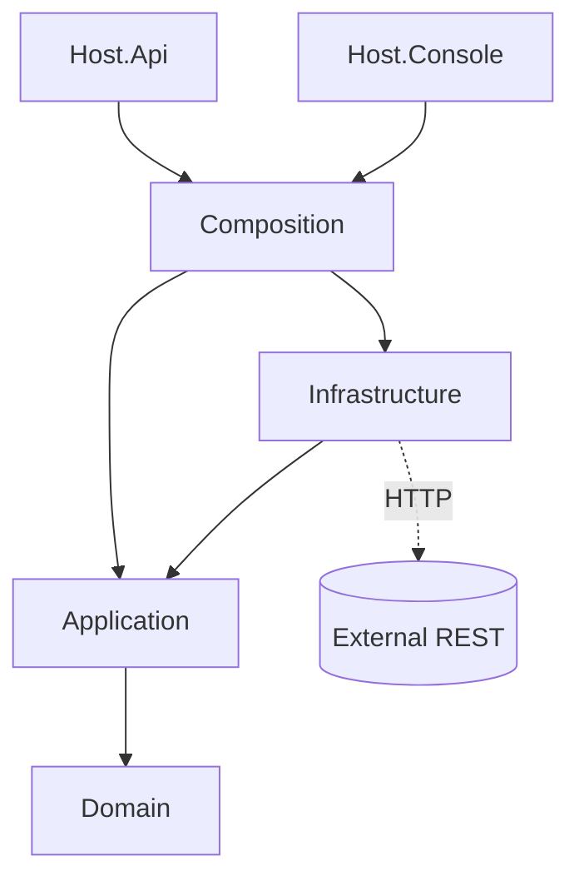

# SKILL.md — `dotnet-weather-hexagonal-scaffold`

```markdown
---
name: dotnet-weather-hexagonal-scaffold
description: >
  Проектирует и генерирует .NET-решение, в котором одно бизнес-ядро (получение
  погоды из публичного REST-API) переиспользуется двумя хостами — консолью и
  Web API — по архитектуре Ports & Adapters (Clean/Onion). Используй, когда
  пользователь просит "спроектировать / создать солюшен" с консолью, веб-апи
  и общей библиотекой, где функционал одинаков, а отличаются только способы
  доставки результата.
version: 1.0.0
tags: [dotnet, architecture, clean-architecture, hexagonal, webapi, console, refit, polly]
allowed-tools: Read, Write, Edit, Bash, Glob
---

# Skill: Каркас .NET-решения «единое ядро + 2 хоста»

## 1. Когда применять

Применяй этот скилл, если запрос содержит комбинацию признаков:
- «консольное приложение + веб апи + общая библиотека»;
- «одинаковый функционал, разные способы вывода»;
- «получить данные из внешнего REST-API (погода, курсы, справочник)»;
- просьба спроектировать архитектуру, а не написать одноразовый скрипт.

НЕ применяй, если достаточно одного проекта (одноразовая утилита, скрипт).

---

## 2. Ключевой архитектурный принцип (не нарушать)

> **Бизнес-логика живёт в одном месте. Хосты — это тонкие адаптеры доставки.**

Зависимости смотрят **строго внутрь, к Domain**:



**Запрещено:** ссылки из `Domain`/`Application` на `Infrastructure`, `Api`, `Console`; протекание доменной модели напрямую в публичный API (нужен маппинг через Contracts).

---

## 3. Структура решения (генерировать именно так)

```
<Solution>/
├─ Directory.Build.props          # TFM, Nullable=enable, ImplicitUsings, TreatWarningsAsErrors
├─ Directory.Packages.props        # Central Package Management (версии только здесь)
├─ <Solution>.sln
├─ src/
│  ├─ <Domain>.Domain/            # модели-рекорды, инварианты, доменные ошибки
│  ├─ <Domain>.Application/       # use-cases, порты (in/out), без внешних SDK
│  ├─ <Domain>.Infrastructure/    # адаптеры ко внешнему REST, Polly, кэш
│  ├─ <Domain>.Composition/       # ЕДИНАЯ точка сборки DI: Add<Domain>Core()
│  ├─ <Domain>.Contracts/         # публичные DTO (request/response)
│  ├─ <Domain>.Api/               # ASP.NET Core minimal API + Swagger
│  └─ <Domain>.Console/           # IHost-based CLI
└─ tests/
   ├─ <Domain>.UnitTests/
   └─ <Domain>.IntegrationTests/
```

---

## 4. Правила слоёв (контракт скилла)

| Слой | Разрешено | Запрещено |
|---|---|---|
| Domain | records, enum, доменные исключения, вычисляемые свойства | любые пакеты, `HttpClient`, атрибуты DI |
| Application | интерфейсы портов, сервисы, `Microsoft.Extensions.*.Abstractions` | прямые вызовы HTTP, знание URL/провайдера |
| Infrastructure | Refit/HttpClient, маппинг, Polly, кэш | бизнес-правила, раздача HTTP-ответов |
| Composition | extension-метод сборки DI, `IOptions`, валидация конфига | логика use-case |
| Contracts | DTO с JSON-атрибутами | доменные типы |
| Hosts (Api/Console) | композиция + резолв `I<Domain>Service` + маппинг в транспорт | дублирование логики |

---

## 5. Пошаговый workflow

1. **Спросить/уточнить** (если не задано): имя домена, внешний API, ключ-авторизация, TFM (default `net10.0`).
2. **Создать solution + проекты** (команды из §9).
3. **Прописать ProjectReference** строго по диаграмме §2.
4. **Domain**: сгенерировать модель-рекорд (§6.1).
5. **Application**: порты `I<Domain>Service` (вход) и `I<Domain>Provider` (выход) + сервис (§6.2).
6. **Infrastructure**: Refit-интерфейс клиента, провайдер, маппинг, кэш-декоратор (§6.3).
7. **Composition**: `Add<Domain>Core()` со всем wiring (§6.4).
8. **Contracts**: DTO + маппинг Domain→DTO.
9. **Api**: minimal API endpoint + ProblemDetails.
10. **Console**: тот же `Add<Domain>Core()` + вывод в stdout.
11. **Tests**: unit (мок порта) + integration (WireMock).
12. **Проверить чек-лист §8** и запустить `dotnet build`.

---

## 6. Шаблоны файлов

### 6.1 Domain
```csharp
namespace Weather.Domain;

public sealed record WeatherSnapshot(
    string City,
    double TemperatureC,
    double FeelsLikeC,
    int HumidityPercent,
    double WindSpeedMs,
    string Condition,
    DateTimeOffset ObservedAt);
```

### 6.2 Application — порты и сервис
```csharp
public interface IWeatherService              // входящий порт (use-case)
{
    Task<WeatherSnapshot> GetCurrentAsync(string city, CancellationToken ct = default);
}

public interface IWeatherProvider             // исходящий порт (внешний мир)
{
    Task<WeatherSnapshot> GetCurrentAsync(string city, CancellationToken ct = default);
}

internal sealed class WeatherService(IWeatherProvider provider) : IWeatherService
{
    public Task<WeatherSnapshot> GetCurrentAsync(string city, CancellationToken ct = default)
    {
        if (string.IsNullOrWhiteSpace(city))
            throw new ArgumentException("City is required", nameof(city));
        return provider.GetCurrentAsync(city.Trim(), ct);
    }
}
```

### 6.3 Infrastructure — Refit + Polly + кэш
```csharp
[Headers("Accept: application/json")]
public interface IOpenWeatherApi
{
    [Get("/data/2.5/weather")]
    Task<OpenWeatherResponse> GetCurrentAsync(
        [Query] string q, [Query] string appid, CancellationToken ct);
}

internal sealed class OpenWeatherProvider(
    IOpenWeatherApi api,
    IOptions<WeatherOptions> options,
    ILogger<OpenWeatherProvider> logger) : IWeatherProvider
{
    public async Task<WeatherSnapshot> GetCurrentAsync(string city, CancellationToken ct)
    {
        var r = await api.GetCurrentAsync(city, options.Value.ApiKey, ct);
        logger.LogInformation("OpenWeather OK for {City}", city);
        return r.ToDomain(city);
    }
}

// декоратор кэша (Scrutor)
internal sealed class CachedWeatherProvider(
    IWeatherProvider inner, IMemoryCache cache) : IWeatherProvider
{
    public async Task<WeatherSnapshot> GetCurrentAsync(string city, CancellationToken ct)
        => await cache.GetOrCreateAsync($"w:{city}",
               async e => { e.AbsoluteExpirationRelativeToNow = TimeSpan.FromMinutes(10);
                            return await inner.GetCurrentAsync(city, ct); })!;
}
```

### 6.4 Composition — единственный источник wiring
```csharp
public static class WeatherServiceCollectionExtensions
{
    public static IServiceCollection AddWeatherCore(this IServiceCollection services, IConfiguration config)
    {
        services.AddOptions<WeatherOptions>()
                .Bind(config.GetSection("Weather"))
                .ValidateDataAnnotations()
                .ValidateOnStart();

        services.AddMemoryCache();

        services.AddRefitClient<IOpenWeatherApi>()
                .ConfigureHttpClient(c => c.BaseAddress = new Uri("https://api.openweathermap.org"))
                .AddStandardResilienceHandler();      // Polly v8: retry + circuit breaker + timeout

        services.AddScoped<IWeatherProvider, OpenWeatherProvider>();
        services.AddScoped<IWeatherService, WeatherService>();
        services.Decorate<IWeatherProvider, CachedWeatherProvider>();
        return services;
    }
}
```

### 6.5 Host: Api
```csharp
var builder = WebApplication.CreateBuilder(args);
builder.Services.AddWeatherCore(builder.Configuration);
builder.Services.AddProblemDetails();

var app = builder.Build();
app.UseExceptionHandler();

app.MapGet("/api/weather/{city}",
        async (string city, IWeatherService svc, CancellationToken ct) =>
            Results.Ok(WeatherResponse.From(await svc.GetCurrentAsync(city, ct))))
   .WithName("GetCurrentWeather")
   .Produces<WeatherResponse>()
   .ProducesProblem(StatusCodes.Status502BadGateway);

app.Run();
```

### 6.6 Host: Console
```csharp
var builder = Host.CreateApplicationBuilder(args);
builder.Services.AddWeatherCore(builder.Configuration);
using var host = builder.Build();

using var scope = host.Services.CreateScope();
var svc = scope.ServiceProvider.GetRequiredService<IWeatherService>();
var city = args.FirstOrDefault() ?? "Moscow";

var w = await svc.GetCurrentAsync(city);
Console.WriteLine($"{w.City}: {w.TemperatureC}°C (feels {w.FeelsLikeC}°C), {w.Condition}");
```

---

## 7. Соглашения

- TFM/настройки — только в `Directory.Build.props`; версии пакетов — только в `Directory.Packages.props` (CPM).
- Публичные члены — XML-doc, `sealed` по умолчанию для реализаций, `record` для моделей.
- Все асинхронные методы принимают `CancellationToken` последним параметром.
- Конфиг: `appsettings.json` → `dotnet user-secrets` (dev) → env vars (prod). Секреты не коммитить.
- Ошибки API — `ProblemDetails`; доменные исключения маппятся на 400/502.

---

## 8. Acceptance checklist (перед «готово»)

- [ ] `dotnet build -warnaserror` проходит без ошибок.
- [ ] В `Application`/`Domain` **нет** ссылок на HttpClient/Refit/ASP.NET.
- [ ] Console и Api вызывают одну и ту же `I<Domain>Service`.
- [ ] Внешний REST изолирован за `I<Domain>Provider`; замена провайдера не трогает Application.
- [ ] Есть `Add<Domain>Core()` — единственная точка wiring, оба хоста её используют.
- [ ] `ValidateOnStart()` на опциях; запуск с пустым `ApiKey` падает явно.
- [ ] Есть unit-тест на сервис (мок провайдера) и integration-тест на HTTP (WireMock).
- [ ] Публичный API возвращает `Contracts`-DTO, а не доменную модель.

---

## 9. Команды генерации каркаса

```bash
dotnet new sln -n WeatherSolution
dotnet new classlib -o src/Weather.Domain
dotnet new classlib -o src/Weather.Application
dotnet new classlib -o src/Weather.Infrastructure
dotnet new classlib -o src/Weather.Composition
dotnet new classlib -o src/Weather.Contracts
dotnet new webapi   -o src/Weather.Api
dotnet new console  -o src/Weather.Console
dotnet new xunit    -o tests/Weather.UnitTests
dotnet new xunit    -o tests/Weather.IntegrationTests

dotnet sln add (ls -r **/*.csproj)   # PowerShell: Get-ChildItem -Recurse *.csproj | % { dotnet sln add $_ }
```

Пакеты (через CPM): `Refit.HttpClientFactory`, `Microsoft.Extensions.Http.Resilience`,
`Microsoft.Extensions.Options.DataAnnotations`, `Scrutor`, `Microsoft.Extensions.Caching.Memory`,
`WireMock.Net`, `Moq`, `FluentAssertions`.

---

## 10. Анти-паттерны (не генерировать)

- ❌ Дублирование логики получения погоды в Console и Api.
- ❌ `HttpClient` прямо в контроллере/UseCase.
- ❌ Общий «God»-проект `Common` без границ слоёв.
- ❌ Возврат доменной модели напрямую из endpoint без DTO.
- ❌ Версии пакетов, раскиданные по .csproj.
- ❌ Синхронные блокирующие вызовы (`.Result`, `.Wait()`).

---

## 11. Definition of Done

Решение собирается, оба хоста запускаются, консоль печатает погоду, API отдаёт JSON
по `GET /api/weather/{city}`, внешний провайдер заменяем за один интерфейс, тесты зелёные.
```
